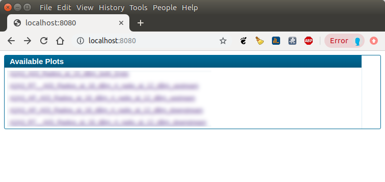
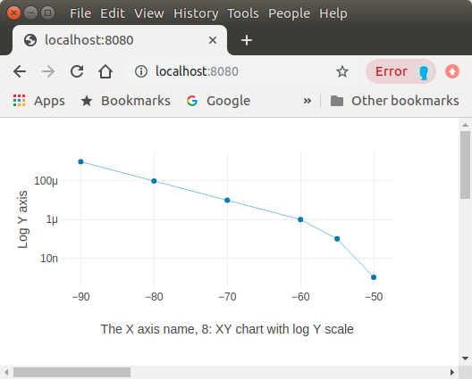

# Netplot Web interface
Up to the advent of the Web interface the Java application had to be running in
order to display a window on which the plots appeared. The web interface is an
experimental alternative to the Java application (netplot.jar).
Currently this has only been tested on google chrome.


In order to run the web interface the following command should be executed in
the web folder of the cloned netplot git repo.

```
    ./netplot_server.py
    INFO: Serve on TCP/IP port 9600
    INFO: Serve on TCP/IP port 9602
    INFO: Serve on TCP/IP port 9601
    INFO: Serve on TCP/IP port 9603
    ...
    INFO: Serve on TCP/IP port 9696
    INFO: Serve on TCP/IP port 9697
    INFO: Serve on TCP/IP port 9698
    INFO: Serve on TCP/IP port 9699
    INFO: Web Server Root: .
    INFO: serving at port 8080
```

The above details all 100 TCP ports waiting to receive connections from the netplot client followed by the web server TCP port.

When running the server is ready to receive netplot commands from the netplot client. These commands are saved to the
netplot_commands.txt file in the local folder.

The above output shows that port 8080 is the web server port. Once the web server is running a user can connect to it
using a browser. A table of available plots are then displayed and the user can select a row in the table to display them.



Select a row to display a page of traces as configured by the netplot client that sent the data. The example below shows a single plot but many plots can be displayed on one page as is the case with the original Java application.



A plot ID can be found by hovering a mouse over a trace in the browser. The format of this is XX_YYY

- XX The plot area number. Top left = 00, the one to the right of it = 01 and so on until the bottom right plot area is reached.

- YYY The plot trace number. A number that details the trace number of the plot.

If the user selects a trace on any plot then the status bar at the bottom of the web page will display the entire legend text as defined when the netplot client sent the data to this netplot server.

** Currently only XY and time series graphs are supported on the web interface**
